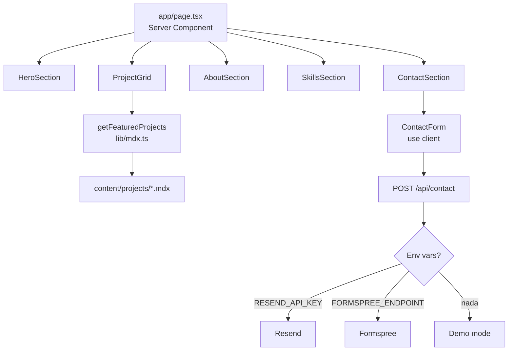

# emanuelmvera.github.io — Portfolio Profesional

Portfolio personal construido con Next.js 16 App Router, TypeScript y Tailwind CSS v4. Diseñado para mostrar proyectos, habilidades técnicas y un formulario de contacto funcional con tres modos de envío.

## Stack

| Capa | Tecnología |
|---|---|
| Framework | Next.js 16.2 (App Router, Server Components) |
| Lenguaje | TypeScript 5 |
| Estilos | Tailwind CSS v4 (`@import "tailwindcss"`) |
| Contenido | MDX via gray-matter + next-mdx-remote |
| Validación | Zod |
| Email | Resend → Formspree → modo demo |
| Testing | Vitest (unit) + Playwright (e2e) |
| Deploy | Vercel |

## Desarrollo local

```bash
# 1. Instalar dependencias
npm install

# 2. Copiar variables de entorno
cp .env.example .env.local
# Editar .env.local con tus valores reales (ver sección Variables de entorno)

# 3. Iniciar servidor de desarrollo
npm run dev
# → http://localhost:3000
```

## Scripts disponibles

```bash
npm run dev          # Servidor de desarrollo con hot-reload
npm run build        # Build de producción
npm run start        # Servidor de producción (requiere build previo)
npm run lint         # ESLint
npm run typecheck    # TypeScript sin emitir (tsc --noEmit)
npm run format       # Prettier sobre todos los archivos
npm test             # Vitest (unit tests)
npm run test:watch   # Vitest en modo watch
npm run test:e2e     # Playwright (requiere servidor corriendo en :3000)
```

## Variables de entorno

Copiar `.env.example` a `.env.local` y completar:

| Variable | Descripción | Requerida |
|---|---|---|
| `RESEND_API_KEY` | API key de Resend para enviar emails | No (activa modo Resend) |
| `RESEND_FROM_EMAIL` | Dirección remitente verificada en Resend | Si usas Resend |
| `RESEND_TO_EMAIL` | Tu email donde recibirás los mensajes | Si usas Resend |
| `FORMSPREE_ENDPOINT` | URL de tu formulario en formspree.io | No (fallback si no hay Resend) |
| `NEXT_PUBLIC_SITE_URL` | URL pública del sitio (sin trailing slash) | Sí (para OG/sitemap) |

**Modos de envío del formulario:**
1. `RESEND_API_KEY` presente → envía email real vía Resend
2. Sin Resend pero con `FORMSPREE_ENDPOINT` → reenvía a Formspree
3. Sin ninguna → **modo demo**: simula éxito con delay de 400ms (útil para dev)

## Reemplazar placeholders de contenido personal

Buscar y reemplazar en todo el proyecto (especialmente `data/site.ts` y los archivos MDX):

| Placeholder | Qué reemplazar |
|---|---|
| `{{NOMBRE_COMPLETO}}` | Tu nombre real |
| `{{EMAIL}}` | Tu email de contacto |
| `{{GITHUB_URL}}` | URL de tu perfil de GitHub |
| `{{LINKEDIN_URL}}` | URL de tu perfil de LinkedIn |
| `{{CV_FILENAME}}` | Nombre del archivo CV en `/public/` (ej: `cv-2025.pdf`) |
| `{{SITE_URL}}` | URL del sitio desplegado |
| `{{APP_CLIMA_DEMO_URL}}` | URL del demo de la App del Clima |
| `{{APP_CLIMA_REPO_URL}}` | URL del repositorio de la App del Clima |
| `{{BILLETERA_DEMO_URL}}` | URL del demo de la Billetera Virtual |
| `{{BILLETERA_REPO_URL}}` | URL del repositorio de la Billetera Virtual |

Ver checklist completo en [`docs/content-replacement-checklist.md`](docs/content-replacement-checklist.md).

## Imágenes de proyectos

Los proyectos usan un placeholder visual mientras no hay imágenes reales. Para agregar imágenes:

1. Poner la imagen en `public/projects/` (formato `.webp` recomendado, ~1200×675px)
2. En el frontmatter del MDX correspondiente, agregar:
   ```yaml
   coverImage: /projects/mi-proyecto.webp
   ```
3. El componente `ProjectCard` detecta la imagen y usa `next/image` automáticamente.

## Deploy en Vercel

```bash
# Con Vercel CLI
vercel

# O conectar el repo en vercel.com → importar proyecto → configurar env vars
```

Configurar las variables de entorno en el dashboard de Vercel (Settings → Environment Variables).

El build usa `output: "standalone"` para el Dockerfile; en Vercel esto se ignora automáticamente.

## Docker

```bash
# Build
docker build --build-arg NEXT_PUBLIC_SITE_URL=https://tu-dominio.com -t portfolio .

# Run
docker run -p 3000:3000 \
  -e RESEND_API_KEY=re_xxx \
  -e RESEND_FROM_EMAIL=onboarding@resend.dev \
  -e RESEND_TO_EMAIL=tu@email.com \
  portfolio
```

## Dark mode

Implementado con clase `dark` en `<html>` + `@variant dark` en Tailwind v4. Sin FOUC gracias al `ThemeScript` Server Component que inyecta un `<script>` inline en `<head>` antes de la hidratación.

La preferencia se guarda en `localStorage` bajo la clave `portfolio-theme` (`"dark"` | `"light"`). Al primer acceso, hereda la preferencia del sistema operativo.

## Arquitectura



## Tests

```bash
# Unit (Vitest + jsdom)
npm test
# → tests/unit/cn.test.ts           (6 casos)
# → tests/unit/contact-schema.test.ts (7 casos)
# → tests/unit/project-utils.test.ts  (2 casos)

# E2E (Playwright, requiere dev server)
npm run dev &
npx playwright install chromium
npm run test:e2e
# → tests/e2e/home.spec.ts    (4 casos)
# → tests/e2e/contact.spec.ts (3 casos)
```

## Estructura del proyecto

```
├── app/
│   ├── api/contact/route.ts     # POST handler del formulario
│   ├── api/projects/route.ts    # GET handler de proyectos
│   ├── projects/[slug]/         # Páginas de detalle de proyecto
│   ├── layout.tsx               # Root layout con fonts, header, footer
│   ├── page.tsx                 # Home (Server Component)
│   └── globals.css              # Tailwind v4 + CSS variables de tema
├── components/
│   ├── ui/                      # Button, Card, Badge, Input, Textarea...
│   ├── layout/                  # Header, Footer, SkipLink, MobileNav...
│   ├── hero/                    # HeroSection, HeroCTAGroup, HeroMockup
│   ├── projects/                # ProjectCard, FeaturedProjectCard, ProjectGrid...
│   ├── about/                   # AboutSection, LearningTimeline
│   ├── skills/                  # SkillsSection, SkillGroup, SkillChip
│   ├── contact/                 # ContactSection, ContactForm, ContactStatus
│   ├── theme/                   # ThemeScript (Server), ThemeToggle (Client)
│   └── analytics/               # ConsentBanner, AnalyticsProvider
├── content/projects/            # App del Clima, Billetera Virtual, Próximamente
├── data/site.ts                 # Todo el copy centralizado
├── lib/                         # cn, mdx, email, validation, env, constants
├── types/project.ts             # Interface Project
└── tests/
    ├── unit/                    # Vitest
    └── e2e/                     # Playwright
```

## Próximos pasos

- [ ] Reemplazar todos los `{{PLACEHOLDER}}` con datos reales
- [ ] Subir CV a `public/` y actualizar `{{CV_FILENAME}}`
- [ ] Agregar imágenes de proyectos a `public/projects/`
- [ ] Configurar Resend (o Formspree) y añadir env vars en Vercel
- [ ] Conectar repositorio a Vercel para deploy automático en push a `main`
- [ ] Instalar browsers de Playwright: `npx playwright install`

## Documentación adicional

- [Checklist de reemplazo de contenido](docs/content-replacement-checklist.md)
- [Plan de base de datos PostgreSQL + Prisma](docs/future-db.md)
- [Cuándo separar la API en Express](docs/express-alternative.md)
